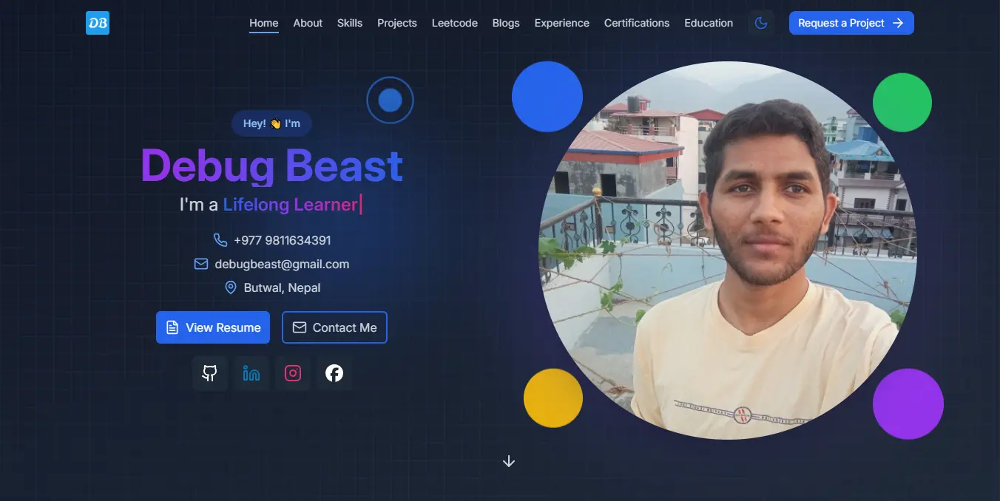

# Debug Beast - beastPortfolio

Welcome to **My Portfolio**! This is my personal portfolio for showcasing my skills, projects, experience, education, certifications, and more. It’s built using React, TypeScript, Tailwind CSS, and other modern web technologies. It fetches data from various APIs to display the latest information, such as GitHub repositories, LeetCode submissions, and blogs. The portfolio is responsive, interactive, and optimized for performance.

Check it out live at: [https://debugbeast.com/](https://debugbeast.com/)

## 📸 Screenshots

Here’s a screenshot of the portfolio:

## References 👏🏻

This project is based on Deepak Modi's Portfolio, which I cloned and modified to fit my needs. You can find the original repository [here](https://github.com/decodewithdeepak/Portfolio).

